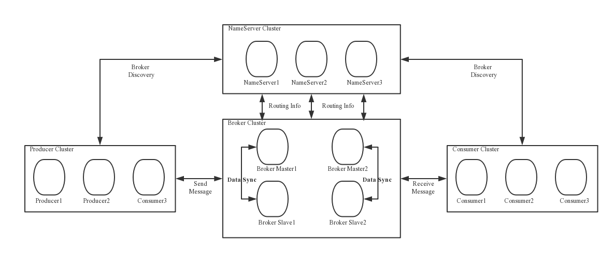

# 架构设计

## 技术架构

RocketMQ架构上主要分为四部分，如上图所示:

- Producer：消息发布的角色，支持分布式集群方式部署。producer通过MQ的负载均衡模块选择相应的Broker集群队列进行消息投递。投递的过程支持快速失败并且低延迟

- Consumer：消息消费者的角色，支持分布式集群方式部署。支持以push推，pull拉两种模式对消息进行消费。同时也支持集群方式和广播形式的消费，它提供实时消息订阅机制，可以满足大多数用户的需求

- NameServer：NameServer是一个非常简单的Topic路由注册中心，其角色类似dubbo中的zookeeper，支持Broker的动态注册与发现。主要包括两个功能：Broker管理，NameServer接受Broker集群的注册信息并且保存下来作为路由信息的基本数据。然后提供心跳检测机制，检查Broker是否还存活。路由信息管理。每个NameServer将保存关于Broker集群的整个路由信息和用于客户端查询的队列信息。然后Producer和Conumser通过NameServer就可以知道整个Broker集群的路由信息，从而进行消息的投递和消费。NameServer通常也是集群的方式部署，各实例间相互不进行信息通讯。Broker是向每一台NameServer注册自己的路由信息，所以每一个NameServer实例上面都保存一份完整的路由信息。当某个NameServer因某种原因下线了，Broker仍然可以向其它NameServer同步其路由信息，Produce,Consumer仍然可以动态感知Broker的路由的信息。 

- BrokerServer：Broker主要负责消息的存储、投递和查询以及服务高可用保证，为了实现这些功能broker包含了以下几个重要子模块。

1.Remoting Module：整个broker的实体，负责处理来自clients端的请求。
2.Client Manager：负责管理客户端(Producer/Consumer)和维护Consumer的topic订阅信息
3.Store Service：提供方便简单的API接口处理消息存储到物理硬盘和查询功能。
4.HA Service：高可用服务，提供master broker 和 slave broker之间的数据同步功能。
5.Index Service：根据特定的Message key对投递到broker的消息进行索引服务，以提供消息的快速查询。

## 部署架构

### RocketMQ 网络部署特点
- NameServer 是一个几乎无状态节点，可集群部署，节点之间无任何信息同步。
- Broker 部署相对复杂，Broker 分为Master 与Slave，一个Master 可以对应多个Slave，但是一个Slave 只能对应一个Master，Master 与Slave 的对应关系通过指定相同的BrokerName，不同的BrokerId 来定义，BrokerId 为0 表示Master，非0 表示Slave。Master 也可以部署多个。每个Broker 与Name Server 集群中的所有节点建立长连接，定时注册Topic 信息到所有Name Server。 注意：当前RocketMQ版本在部署架构上支持一master多slave，但只有brokerId=1的从服务器才会参与消息的读负载。
- Producer与NameServer 集群中的其中一个节点（随机选择）建立长连接，定期从NameServer 获取Topic 路由信息，并向提供Topic 服务的Master 建立长连接，且定时向Master 发送心跳。Producer 完全无状态，可集群部署。
- Consumer与NameServer 集群中的其中一个节点（随机选择）建立长连接，定期从NameServer取Topic路由信息，并向提供Topic服务的Master、Slave建立长连接，且定时向Master、Slave发送心跳。Consumer既可以从Master订阅消息，也可以从Slave订阅消息，消费者在向master拉取消息时Master服务器会根据拉取偏移量与最大偏移量的距离（判断是否读老消息，产生读IO），以及从服务器是否可读等因素建议下一次是从Master还是Slave拉取。

结合部署结构图，描述集群工作流程：

1. 启动Namesrv，Namesrv起来后监听端口，等待Broker、Produer、Consumer连上来，相当于一个路由控制中心。
2. Broker启动，跟所有的Namesrv保持长连接，定时发送心跳包。心跳包中包含当前Broker信息(IP+端口等)以及存储所有topic信息。注册成功后，namesrv集群中就有Topic跟Broker的映射关系
3. 收发消息前，先创建topic，创建topic时需要指定该topic要存储在哪些Broker上。也可以在发送消息时自动创建Topic
4. Producer发送消息，启动时先跟Namesrv集群中的其中一台建立长连接，并从Namesrv中获取当前发送的Topic存在哪些Broker上，轮询从队列列表中选择一个队列，然后与队列所在的Broker建立长连接从而向Broker发消息
5. Consumer跟Producer类似。跟其中一台Namesrv建立长连接，获取当前订阅Topic存在哪些Broker上，然后直接跟Broker建立连接通道，开始消费消息
